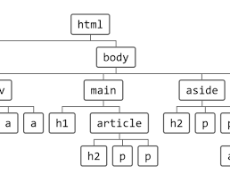

# Parsing with requests_html

Requests-HTML is an excellent tool for parsing HTML code and grabbing exactly the information you need. So whether you're pulling down headlines from news sites, scores from sports websites, or prices from an online store... Requests-HTML and Python will help you get this done quickly and easily

# Project:
- parsingHTMLfrom.file
- parsingHTMLfrom.website
- saves the output in csv

### Note: Check the contents of the website (on the browser)
- write click on the contents of the website
- click inspect > Under Elements Tab

### Hierarchy of HTML page

- Article > Header > H1 or H2 > p
- h1 or h2 - headline
- p - paragraph- shows description/summary
- iframe- shows Youtube video link
