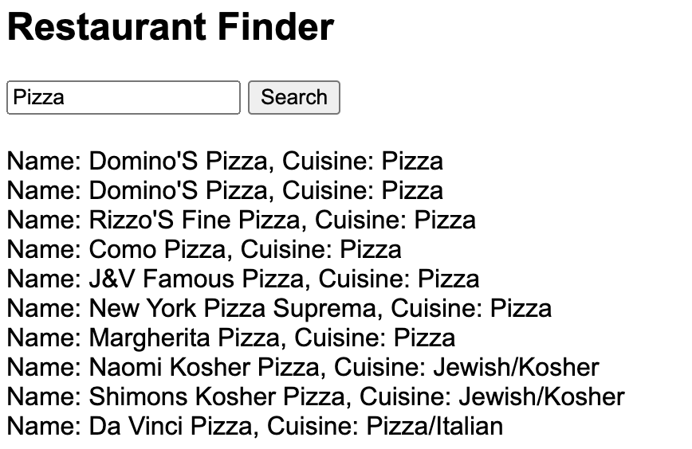

# Restaurant API - Comprehensive Guide

Welcome to the Restaurant API, a full-fledged Node.js application that provides access to a vast database of restaurants. This guide walks you through the completed to-dos, from project setup to deployment, and illustrates how you can utilize this API for your projects.

## Completed Tasks Overview

- **Project Setup:** Node.js project initialized with essential libraries (`express`, `mongoose`, `dotenv`) installed.
- **Database Schema Design:** MongoDB schema designed and implemented with Mongoose to accurately represent restaurant data, including complex structures like addresses and grades.
- **Database Setup and Data Import:** MongoDB database setup completed with a script developed to import `restaurants.json` into the database.
- **API Development:** RESTful API endpoints created for searching restaurants by various criteria and supporting pagination.
- **Query Optimization:** Database queries optimized with indexes and efficient query structures to ensure speedy data retrieval.
- **Testing:** Comprehensive tests written and passed, ensuring API reliability and correctness.
- **API Documentation:** API endpoints documented clearly with query parameters and usage examples.
- **Deployment:** Application deployed to a cloud platform, accessible and fully functional in a production environment.
- **Frontend Development:** A simple frontend developed to demonstrate API usage, showcasing real-time data interaction.



## Getting Started

### Installation and Setup

Clone the project and install dependencies:

```bash
git clone <repository-url>
cd my-restaurant-api

// Install  dependencies using npm
npm install
```

### Running the Server

Launch the server to make the API accessible:

```bash
npm start
```

### Running Tests

Verify API functionality and robustness:

```bash
npm test
```

### Exploring the API

Access the API using the following endpoints:

- Home: curl <http://localhost:3000/>
- All Restaurants: curl <http://localhost:3000/api/restaurants>
- Search by Name: curl <http://localhost:3000/api/search?name=Pizza>
- Search by Cuisine with Pagination: curl "<http://localhost:3000/api/search?cuisine=Italian&page=1&limit=5>"
- Search by Address: curl "<http://localhost:3000/api/search?address=Main+Street>"

### Documentation

For detailed information on API usage, including all available endpoints and query parameters, refer to the API Documentation.

### Contributing

Interested in contributing? Follow these steps:

Fork the repository.
Create a new branch for your feature (git checkout -b feature/AmazingFeature).
Commit your changes (git commit -m 'Add some AmazingFeature').
Push to the branch (git push origin feature/AmazingFeature).
Open a pull request.

### Acknowledgments

MongoDB Atlas for hosting the database.
